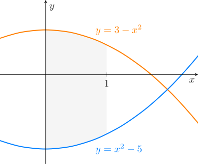

We will explore some of the basic applications of integration. Applications will be both geometrically and physically inspired. 


```{r, fig.align="center", fig.cap="A nice image."}

```

Another image: 
{ height=100% }