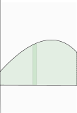
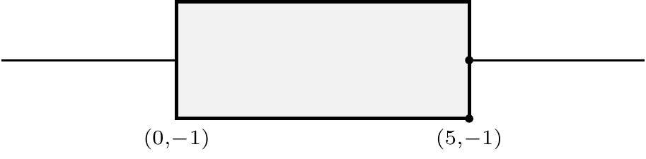

The center of mass of a collection of points $\{(x_i, y_i)\}\subset \mathbb R^2$ is $\left(\overline x, \overline y\right)$ where
\begin{equation}
    \overline x = \frac 1 n\sum_{i = 1}^n x_i,
    \qquad
    \overline y = \frac 1 n\sum_{i = 1}^n y_i.
(\#eq:com)
\end{equation}
Equations \@ref(eq:com), say that the center of mass is the point whose $x$-coordinate is the average of the $x$-coordinates of the data and whose $y$-coordinate is the average of the $y$-coordinates of the data points. 

```{theorem}
The center of mass is $\left(\bar x, \bar y\right)$ as described above. 
```

Now some other stuff


This is a tikz picture. Unfortunately, the output quality looks poor. 

```{r, echo=FALSE, engine='tikz', out.width='90%', fig.ext=if (knitr:::is_latex_output()) 'pdf' else 'png', dpi = 500, fig.cap='This is a test to see if tikz is working.'}
\begin{tikzpicture}[scale=.7]
    \draw [fill=gray!10,very thick] (0,-1) rectangle (5,1);
    \draw [thick] (5, 0) -- (8,0);
    \draw [thick] (-3, 0) -- (0, 0); 
    \fill (5, -1) node [below]{$\scriptstyle(5, -1)$} circle (2pt);
    \fill (5, 0) circle (2pt); 
    \node [below, align=center] at (0,-1) {$\scriptstyle(0, -1)$};
\end{tikzpicture}
```

stuff above
\begin{tikzpicture}[scale=.7]
    \draw [fill=gray!10,very thick] (0,-1) rectangle (5,1);
    \draw [thick] (5, 0) -- (8,0);
    \draw [thick] (-3, 0) -- (0, 0); 
    \fill (5, -1) node [below]{$\scriptstyle(5, -1)$} circle (2pt);
    \fill (5, 0) circle (2pt); 
    \node [below, align=center] at (0,-1) {$\scriptstyle(0, -1)$};
\end{tikzpicture}
and below
Run `pdflatex box.tex` and then run `pdf2svg box.pdf box.svg` to converg to `.svg` format. Manually include the `.svg` file. using 

```{r, echo=TRUE, fig.align="center", fig.cap="A nice image."}

```
Alternatively, `{ height=100% }` gives
{ height=100% }
It looks like I can manually include figures with the syntax ``, where `boards.jpg` is stored in the same directory: 


{ height=50% }



{width=400px height=200px}


So evidently I should just do plots directly in `R`, but how do I get the nice typeset math? 


````{r, out.width='90%'}
library(ggplot2)
oplot <- ggplot(Orange, aes(x = age, 
                   y = circumference, 
                   colour = Tree)) +
  geom_point() +
  geom_line() +
  guides(colour = FALSE) +
  theme_bw()
oplot
````

````{r}
library(DiagrammeR)
g1 <- "digraph boxes_and_circles {
      graph [layout = circo,
             overlap = true]
      node [shape = circle,
            fixedsize = true,
            fontname = Helvetica,
            width = 1]
      Problem; Plan; Data; Analysis; Conclusion
    
      edge [color = grey]      
      Problem -> Plan
      Plan -> Data
      Data -> Analysis
      Analysis -> Conclusion
      Conclusion -> Problem
      }"
grViz(g1)
````
